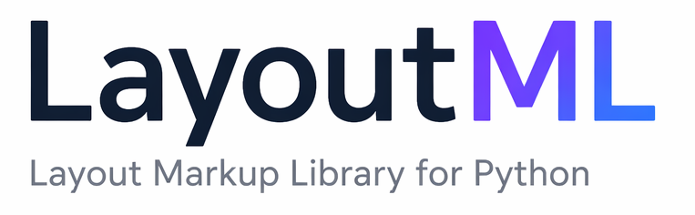

````md
<p align="center">
    
</p>
<p align="center">
    <em>LayoutML (Layout Markup Library) is a library that allows you to describe the structure of web pages directly through code, turning Python into a markup language for web interfaces.</em>
</p>

[English version](README_EN.md)

## Key Features

- Creating HTML elements through Python classes
- Defining CSS styles programmatically
- Component-based approach (reusable layout blocks)
- Readable and declarative syntax
- Generating clean HTML/CSS without unnecessary code
- Easy integration with FastAPI, Flask, and Django
- Lightweight with no external dependencies

## Who It’s For

- Python developers who don’t want to write HTML manually
- Backend developers (FastAPI / Django / Flask)
- Educational projects
- Generating HTML reports and interfaces
- Building custom web frameworks on top of LayoutML

## Contents

### Core Classes

- [CSSBase](docs/en/base/css/CSSBase.md) - Base class for working with CSS styles
- [CSSInline](docs/en/base/css/CSSInline.md) - Class for working with inline styles
- [CSSSelectors](docs/en/base/css/CSSSelectors.md) - Class for managing CSS selectors

### Base Elements

- [BaseElement](docs/en/base/BaseElement.md) - Base class for all HTML elements
- [HTMLElement](docs/en/base/HTMLElement.md) - Class for working with HTML attributes

### Semantic Elements

- [Header](docs/en/elements/Header.md) - Semantic header element `<header>`
- [Main](docs/en/elements/Main.md) - Semantic main content element `<main>`
- [Footer](docs/en/elements/Footer.md) - Semantic footer element `<footer>`
- [Nav](docs/en/elements/Nav.md) - Semantic navigation element `<nav>`
- [Section](docs/en/elements/Section.md) - Semantic section element `<section>`
- [Article](docs/en/elements/Article.md) - Semantic article element `<article>`
- [Aside](docs/en/elements/Aside.md) - Semantic sidebar element `<aside>`

### Text Elements

- [Paragraph](docs/en/elements/Paragraph.md) - Paragraph element `<p>`
- [Span](docs/en/elements/Span.md) - Inline container `<span>`
- [Anchor](docs/en/elements/Anchor.md) - Link element `<a>`
- [Heading](docs/en/elements/Heading.md) - Heading elements `<h1>-<h6>`
- [ListElement](docs/en/elements/list/ListElement.md) - Base class for lists
- [UnorderedList](docs/en/elements/list/UnorderedList.md) - Unordered list `<ul>`
- [OrderedList](docs/en/elements/list/OrderedList.md) - Ordered list `<ol>`

### Media Elements

- [Image](docs/en/elements/Image.md) - Image element ``

### Form Elements

- [Form](docs/en/elements/Form.md) - Base class for form elements
- [FormElement](docs/en/elements/FormElement.md) - Form input element `<input>`
- [Input](docs/en/elements/Input.md) - Specialized input element
- [Label](docs/en/elements/Label.md) - Label element `<label>`
- [Button](docs/en/elements/Button.md) - Button element `<button>`
- [Select](docs/en/elements/Select.md) - Dropdown list element `<select>`
- [Textarea](docs/en/elements/Textarea.md) - Multiline text field `<textarea>`

### Layout

- [Layout](docs/en/layout/Layout.md) - Base class for layouts (Flexbox)
- [HorizontalLayout](docs/en/layout/HorizontalLayout.md) - Horizontal layout
- [VerticalLayout](docs/en/layout/VerticalLayout.md) - Vertical layout

### Document Structure

- [Head](docs/en/Head.md) - Page header element `<head>`
- [Body](docs/en/Body.md) - Page body element `<body>`
- [Page](docs/en/Page.md) - Complete HTML document

### Routing

- [Router](docs/en/router/Router.md) - URL routing class

### Application

- [LayoutML](docs/en/LayoutML.md) - Main application class

## Quick Start

### Installation

```bash
pip install layoutml
```
````

## Usage Examples

This section contains examples of building web applications with LayoutML. You’ll learn how to create pages, add elements, and run the server.

### Basic Launch

The easiest way to run a LayoutML application:

```python
from layoutml import LayoutML, Page
from layoutml.elements import Button, Label
from layoutml.layout import VerticalLayout

class BasePage(Page):
    def __init__(self, object_name=None, doctype="html", title="LayoutML", lang="ru", **kwargs):
        super().__init__(object_name=object_name, doctype=doctype, title=title, lang=lang, **kwargs)
        self.head.set_icon("ico/logo.ico")

# Creating application
app = LayoutML()

# Creating page
main_page = BasePage(title="Home")
# Creating elements
label = Label(text="Hello World!")
button = Button(text="Click me", onclick="alert('Hello!')")
# Creating layout
v_layout = VerticalLayout(object_name="v_layout")
v_layout.add_element(label)
v_layout.add_element(button)
# Adding elements to page
main_page.body.add_element(v_layout)
# Registering page
app.include_page(main_page)

# Defining route
@app.route("/")
def home():
    page = main_page.copy()
    return page

# Starting application
if __name__ == "__main__":
    app.start(host="localhost", port=3700)
```

After запуск, the server will be available at [http://localhost:3700](http://localhost:3700)

### Running with Uvicorn from Command Line

You can run the application using Uvicorn from the terminal:

```bash
pip install uvicorn
uvicorn main:app --host localhost --port 3700 --reload
```

Where `main` is your Python filename, and `app` is the name of your LayoutML application instance.

### Running Uvicorn from Python Code

You can also launch Uvicorn directly from a Python script:

```python
if __name__ == "__main__":
    uvicorn.run(app, host="localhost", port=3700)

```

### Creating Multiple Routes

Example application with multiple pages:

```python
from layoutml import LayoutML, Page
from layoutml.elements import Anchor, Button, Label, Paragraph
from layoutml.layout import VerticalLayout

class BasePage(Page):
    def __init__(self, object_name=None, doctype="html", title="LayoutML", lang="ru", **kwargs):
        super().__init__(object_name=object_name, doctype=doctype, title=title, lang=lang, **kwargs)
        self.head.set_icon("ico/logo.ico")

def get_main_page() -> Page:
    # Creating page
    main_page = BasePage(title="Home")
    # Creating elements
    label = Label(text="Hello World!")
    button = Button(text="Click me", onclick="alert('Hello!')")
    # Creating layout
    v_layout = VerticalLayout(object_name="v_layout")
    v_layout.add_element(label)
    v_layout.add_element(button)
    # Adding elements to page
    main_page.add_element(v_layout)

    return main_page

def get_about_page() -> Page:
    # Creating page
    page = BasePage(title="About Us")
    # Creating elements
    paragraph = Paragraph(text="We build web applications using LayoutML")
    back_link = Anchor(href="/", text="Back to Home")
    # Adding elements to page
    page.add_element(paragraph)
    page.add_element(back_link)

    return page

# Creating application
app = LayoutML()

# Registering pages
main_page = get_main_page()
about_page = get_about_page()
app.include_page(main_page)
app.include_page(about_page)

# Defining routes
@app.route("/")
def home():
    page = main_page.copy()
    return page

@app.route("/about")
def about():
    page = about_page.copy()
    return page

# Starting application
if __name__ == "__main__":
    app.start(host="localhost", port=3700)
```

### Using Route Parameters

You can create dynamic pages with URL parameters:

```python
from layoutml import LayoutML, Page
from layoutml.elements import Button, Label
from layoutml.layout import VerticalLayout

def get_echo_page() -> Page:
    # Creating page
    main_page = Page(title="Home")
    # Creating elements
    label = Label(text="Hello World!")
    button = Button(object_name="button", text="Click me", onclick="alert('Hello!')")
    # Creating layout
    v_layout = VerticalLayout(object_name="v_layout")
    v_layout.add_element(label)
    v_layout.add_element(button)
    main_page.add_element(v_layout)

    return main_page

# Creating application
app = LayoutML()
# Registering page
username_page = get_echo_page()
app.include_page(username_page)
# Defining route

@app.route("/echo")
def echo(username: str):
    page = username_page.copy()
    button: Button = page.get_element("v_layout").get_element("button")
    button.text += f" {username}"
    return page
# Starting application
if __name__ == "__main__":
    app.start(host="localhost", port=3700)
```

### Adding CSS Styles

Example page with custom styles:

```python
from layoutml import LayoutML, Page
from layoutml.elements import Paragraph, Button


def get_page() -> Page:
    page = Page(object_name="main_page", title="Styled Page")
    paragraph = Paragraph(text="This text is styled with CSS", class_="highlight-text")
    button = Button(
        text="Stylish Button",
        class_="custom-button",
        style="padding: 10px 20px; background: #007bff; color: white; border: none; border-radius: 5px;",
    )
    # Adding CSS styles via head object
    page.head.selectors_styles.add_selector(".main-header")\
        .set_background_color("#f8f9fa")\
        .set_padding("20px")\
        .set_text_align("center")

    page.head.selectors_styles.add_selector(".highlight-text")\
        .set_color("#007bff")\
        .set_font_size("18px")\
        .set_font_weight("bold")

    page.head.selectors_styles.add_selector(".custom-button:hover")\
        .set_background_color("#0056b3")\
        .set_transform("scale(1.05)")

    page.body.add_element(paragraph)
    page.body.add_element(button)

    return page

app = LayoutML()
main_page = get_page()
app.include_page(main_page)

@app.route("/")
def styled_page():
    page = main_page.copy()
    return page

if __name__ == "__main__":
    app.start()
```

### Using Layouts

Creating a page with horizontal and vertical layouts:

```python
from layoutml import LayoutML, Page
from layoutml.elements import  Paragraph, Button
from layoutml.layout import HorizontalLayout, VerticalLayout

def get_page() -> Page:
    page = Page(object_name="main_page", title="Layout Example")
    # Vertical layout for the whole page
    main_layout = VerticalLayout(object_name="mainLayout")
    main_layout.object_styles.set_gap("20px").set_padding("20px")
    # Horizontal layout for navigation
    nav_layout = HorizontalLayout(object_name="navLayout")
    nav_layout.object_styles.set_justify_content("space-between")
    nav_layout.add_element(Button(text="Home"))
    nav_layout.add_element(Button(text="About Us"))
    nav_layout.add_element(Button(text="Contacts"))
    # Horizontal layout for cards
    cards_layout = HorizontalLayout(object_name="cardsLayout")
    cards_layout.object_styles.set_gap("20px").set_justify_content("center")
    for i in range(3):
        card = VerticalLayout(object_name=f"card{i}")
        card.object_styles.set_border("1px solid #ddd").set_padding("15px").set_border_radius("8px").set_width("200px")
        card.add_element(Paragraph(text=f"Card {i+1}"))
        card.add_element(Button(text="Learn More"))
        cards_layout.add_element(card)
    main_layout.add_elements(nav_layout, cards_layout)
    page.body.add_element(main_layout)

    return page

app = LayoutML()
main_page = get_page()
app.include_page(main_page)

@app.route("/")
def layout_example():
    page = main_page.copy()
    return page

if __name__ == "__main__":
    app.start()
```

### Form Handling

Example of creating a page with a form and handling data:

```python
from layoutml import LayoutML, Page
from layoutml.elements import Input, Button, Label, Paragraph
from layoutml.layout import VerticalLayout, HorizontalLayout


def get_form_page():
    page = Page(object_name="form_page", title="Contacts")
    page.body.add_element(Paragraph(text="Contact Us"))
    # Creating form
    h_layout_name = HorizontalLayout(object_name="h_layout_name")
    h_layout_email = HorizontalLayout(object_name="h_layout_email")
    # Name field
    h_layout_name.add_element(Label(for_id="name", text="Name:"))
    h_layout_name.add_element(Input(id="name", name="name", required=True))
    # Email field
    h_layout_email.add_element(Label(for_id="email_label", text="Email:"))
    h_layout_email.add_element(Input(type="email", id="email", name="email", required=True))
    # Submit button
    button = Button(text="Submit", type="submit")
    v_layout = VerticalLayout(object_name="v_layout")
    v_layout.add_elements(h_layout_name, h_layout_email, button)
    page.body.add_element(v_layout)
    # Disabling automatic CSS file rendering for page
    page.render_css_file = False
    page.add_stylesheet(href="styles/form_page_styles.css")
    return page
```

```css
/* form_page_styles.css */

@import url("https://fonts.googleapis.com/css2?family=Inter:wght@400;500;600&display=swap");

* {
  margin: 0;
  padding: 0;
  box-sizing: border-box;
}

body.Body {
  font-family: "Inter", sans-serif;
  background: #f8fafc;
  color: #1e293b;
  min-height: 100vh;
  display: flex;
  justify-content: center;
  align-items: center;
  padding: 20px;
}

.v_layout {
  background: #ffffff;
  width: 100%;
  max-width: 480px;
  padding: 40px;
  border-radius: 20px;
  box-shadow: 0 10px 40px rgba(15, 23, 42, 0.08);
  display: flex;
  flex-direction: column;
  gap: 24px;
  border: 1px solid rgba(226, 232, 240, 0.8);
}

.ParagraphElement {
  position: absolute;
  top: 80px;
  font-size: 2rem;
  font-weight: 600;
  color: #0f172a;
  letter-spacing: -0.5px;
}

.h_layout_name,
.h_layout_email {
  display: flex;
  flex-direction: column;
  gap: 8px;
}

.LabelElement {
  font-size: 0.95rem;
  font-weight: 500;
  color: #475569;
}

.InputElement {
  width: 100%;
  padding: 14px 16px;
  border: 1.5px solid #e2e8f0;
  border-radius: 14px;
  font-size: 1rem;
  background: #f8fafc;
  transition: all 0.25s ease;
  outline: none;
}

.InputElement:focus {
  border-color: #6366f1;
  background: #ffffff;
  box-shadow: 0 0 0 4px rgba(99, 102, 241, 0.12);
}

.ButtonElement {
  margin-top: 10px;
  padding: 15px;
  border: none;
  border-radius: 14px;
  background: #6366f1;
  color: white;
  font-size: 1rem;
  font-weight: 600;
  cursor: pointer;
  transition: all 0.25s ease;
}

.ButtonElement:hover {
  background: #4f46e5;
  transform: translateY(-2px);
  box-shadow: 0 8px 20px rgba(99, 102, 241, 0.25);
}

.ButtonElement:active {
  transform: translateY(0);
}

@media (max-width: 600px) {
  .v_layout {
    padding: 28px;
  }

  .ParagraphElement {
    font-size: 1.6rem;
    top: 40px;
  }
}
```

### Complete Usage Example

```python
from layoutml import LayoutML, Page, Request, Response, JSONResponse

# Creating application
app = LayoutML(styles_dirname="assets/css")

# Creating base page
class BasePage(Page):
    def __init__(self, object_name: str, title="LayoutML", **kwargs):
        super().__init__(object_name=object_name, title=title, **kwargs)
        self.head.set_icon("static/logo.ico")  # Setting icon

# Creating and registering page
main_page = BasePage(object_name="main_page", title="Home")
main_page.body.add_content("<h1>Welcome!</h1>")
app.include_page(main_page)

# HTML route
@app.route("/")
async def home(request: Request, response: Response):
    page = main_page.copy()
    page.body.add_content("<p>This is the home page</p>")
    return page

# API route with JSON response
@app.route("/api/data")
async def get_data(request: Request, response: Response):
    return JSONResponse(content={"status": "ok", "data": [1, 2, 3]})

# Route with parameters
@app.route("/user")
async def user_profile(
    request: Request,
    response: Response,
    user_id: int,
    name: str = "Guest",
):
    page = main_page.copy()
    page.title = f"{name}'s Profile"
    page.body.add_content(f"<h1>User: {name} (ID: {user_id})</h1>")
    return page

# Custom 404 page
custom_404 = BasePage(object_name="error_page", title="Page Not Found")
custom_404.body.add_content("""
    <div style="text-align: center; padding: 50px;">
        <h1>404</h1>
        <p>Page not found</p>
        <a href="/">Back to Home</a>
    </div>
""")
app.set_error_page(custom_404)

if __name__ == "__main__":
    app.print_routes()  # Viewing routes
    app.start(host="localhost", port=3700)
```

## Development Tips

1. Development mode: Use the `--reload` flag when running through Uvicorn for automatic reload on code changes.
2. Debugging: You can print route information using the `print_routes()` method:

```python
app.print_routes()
```

3. Code structuring: For large applications, it is recommended to split routes into modules:

```python
# routes.py
from layoutml import LayoutML
app = LayoutML()
# Import routes from other modules

from .home_routes import home_router
from .api_routes import api_router

app.include_router(home_router)
app.include_router(api_router, prefix="/api")
```

4. Async handlers: LayoutML supports asynchronous route handlers:

```python
@app.route("/async-data")
async def async_data():
  data = await fetch_data_from_db()
  page = Page(title="Data")
  page.body.add_element(Paragraph(text=str(data)))
  return page
```

## Best Practices

### 1. Use page copying

```python
# Always copy page inside handler
@app.route("/profile")
def profile_handler(request: Request, response: Response):
    page = base_page.copy()  # ✅
    return page
```

### 2. Register all pages

```python
# Register all used pages
app.include_page(home_page)
app.include_page(about_page)
app.include_page(contact_page)
```

### 3. Use a base page class to set icons for all pages

```python
class AppPage(Page):
    def __init__(self, title="App", **kwargs):
        super().__init__(title=title, **kwargs)
        self.head.set_icon("/static/favicon.ico")
        self.head.add_stylesheet("/static/app.css")
```

### 4. Handle errors

```python
@app.route("/protected")
async def protected(request: Request, response: Response):
    if not request.headers.get("Authorization"):
        raise HTTPException(status_code=401, detail="Unauthorized")
    return page.copy()
```

## Project Status

LayoutML is under active development.

## 📄 License

[MIT License](LICENSE)

## Feedback

I’m always happy to receive your feedback and suggestions for improving LayoutML. Please leave your comments.

Email

- [Email](mailto:feed619pro@gmail.com)
